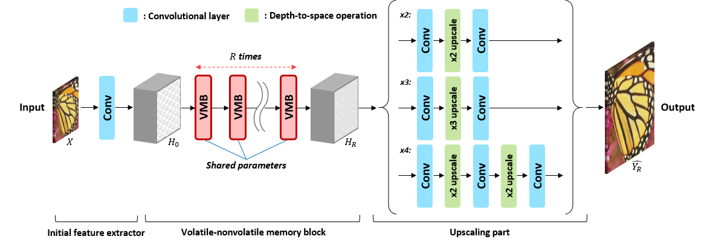

# Volatile-Nonvolatile Memory Network (VMNet) for Progressive Image Super-Resolution



This repository contains the official TensorFlow-based implementation of the VMNet model, which is explained in the following paper.
- J.-H. Choi, J.-H. Kim, M. Cheon, J.-S. Lee: Volatile-nonvolatile memory network for progressive image super-resolution. IEEE Access (2021), vol. 9, pp. 37487-37496 [[Paper]](https://doi.org/10.1109/ACCESS.2021.3063760)
```
@article{choi2021volatile,
  title={Volatile-Nonvolatile Memory Network for Progressive Image Super-Resolution},
  author={Choi, Jun-Ho and Kim, Jun-Hyuk and Cheon, Manri and Lee, Jong-Seok},
  journal={IEEE Access},
  volume={9},
  pages={37487--37496},
  year={2021},
  publisher={IEEE}
}
```

## Dependencies

- Python 3.6+
- TensorFlow 1.12+ (<2.0)

## Testing the pre-trained model

We provide the pre-trained multi-scale VMNet model in the ```checkpoints/``` directory.
To test with it, use the following code:
```shell
python test_vmnet.py
  --model=vmnet
  --vmnet_model_scales=2,3,4
  --vmnet_recursion_frequency=16
  --restore_path=checkpoints/vmnet_c64_s64_x234_2000k.ckpt
  --input_path=<path of input images>
  --scale=<scaling factor [2|3|4]>
```
The super-resolved images will be saved at ```SR/``` folder.
You can change the destination folder with ```--output_path=<path of output images>```.

## Training

The original VMNet model is trained with the DIV2K dataset.
You can download the images from its [official website](https://data.vision.ee.ethz.ch/cvl/DIV2K/).
After downloading and extracting the images, the directory structure may be looked like this:
```
/tmp/dataset/DIV2K/
|- DIV2K_train_LR_bicubic/
   |- X2/
      |- 0001x2.png
      |- 0002x2.png
      |- ...
   |- X3/
      |- 0001x3.png
      |- 0002x3.png
      |- ...
   |- X4/
      |- 0001x4.png
      |- 0002x4.png
      |- ...
|- DIV2K_train_HR/
   |- 0001.png
   |- 0002.png
   |- ...
```

Now you can train the model with the following command:
```shell
python train.py
  --dataloader=div2k_loader
  --data_input_path=/tmp/dataset/DIV2K/DIV2K_train_LR_bicubic
  --data_truth_path=/tmp/dataset/DIV2K/DIV2K_train_HR
  --train_path=/tmp/vmnet
  --model=vmnet
  --scales=2,3,4
  --vmnet_learning_rate_decay_steps=400000
  --vmnet_clip_norm=5
```
If your computer has sufficient amount of RAMs (e.g., more than 16GB), specify ```--data_cached``` to boost the training speed.

You can also change other parameters, e.g., batch size, the number of convolutional channels, and learning rate.
Please run ```python train.py --dataloader=div2k_loader --model=vmnet --helpfull``` for more information.

During the training, you can view the current training status via TensorBoard, e.g.,
```
tensorboard --logdir=/tmp/vmnet
```

You can also validate the trained model by ```validate_vmnet.py```.
For example, if you want to evaluate the model saved at step 50000 with the BSD100 dataset, run
```shell
python validate_vmnet.py
  --dataloader=basic_loader
  --data_input_path=/tmp/dataset/BSD100/LR
  --data_truth_path=/tmp/dataset/BSD100/HR
  --model=vmnet
  --scales=2,3,4
  --vmnet_model_scales=2,3,4
  --vmnet_recursion_frequency=16
  --restore_path=/tmp/vmnet/model.ckpt-50000
  --save_path=/tmp/vmnet/results
```
It will print out the PSNR and RMSE values of the upscaled images with saving them on the path that you specified in ```--save_path```.
Please run `python validate_vmnet.py --model=vmnet --helpfull` for more information.

You can also try validating the intermediate outputs by adjusting ```--vmnet_recursion_frequency``` to 1.

Note that the calculated PSNR and RMSE values may differ from the the values in our paper, due to the different calculation methods.
The code in this repository calculates PSNR and RMSE values from R, G, and B channels, while the measures reported in the paper were obtained from Y channel of the YCbCr color space.
